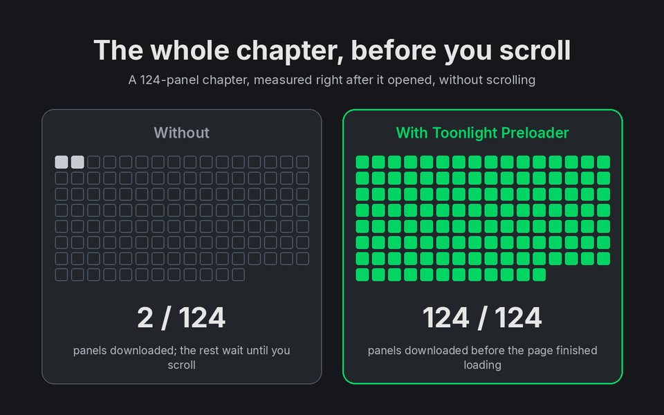
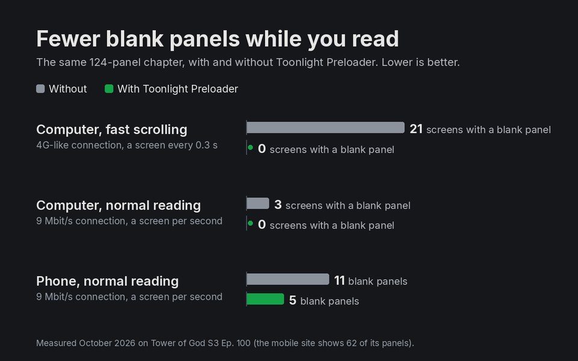
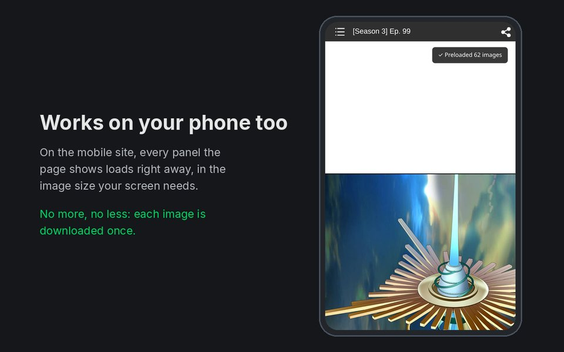

# Webtoons Chapter Preloader

Loads every panel of a [WEBTOON](https://www.webtoons.com) chapter as soon as the page opens, instead of one at a time as you scroll, so you can read without waiting for panels to fill in. On desktop and on your phone, as a userscript or as the **Toonlight Preloader** browser extension.

[](LICENSE)
[](https://greasyfork.org/en/scripts/575967-webtoons-chapter-preloader)
[](https://greasyfork.org/en/scripts/575967-webtoons-chapter-preloader)

## What it does

Webtoons.com lazy-loads chapter images as you scroll, which produces a brief blank-image flash every time a new panel comes into view — especially noticeable on slower connections or long chapters. This script asks for the whole chapter while the page is still opening, in reading order: panel 1 first, then the rest of the first screen, then everything else at once. It also decodes images a few screens ahead of where you're reading. By the time you scroll, the panels are already downloaded and the next few are ready to paint. It never scrolls the page itself and has nothing to configure.



Measured on a 124-panel chapter (Tower of God S3 Ep. 100) in Chrome, Edge and Firefox; the method is in [`extension/STORE.md`](extension/STORE.md):

- **Fast connection:** all 124 panels were downloaded before the page itself had finished loading. Without the preloader, 2 had been.
- **Slow connection** (9 Mbit/s), reading one screen per second: on a computer, screens with a blank panel went from 3 to 0; on a phone, blank panels went from 11 to 5.
- **Fast scrolling** on a 4G-like connection (computer): screens with a blank panel went from 21 to 0.
- **Order on fresh episodes** (episodes the image server hadn't cached, a new one for every run): with version 1.3.1, panel 1 arrived first in **11 of 11** runs, and panels 1–6 took the first six places in 9 of 11. Requesting the whole chapter at once (version 1.3.0), panel 1 arrived anywhere from 1st to 109th.

<details>
<summary>The 11 runs (version 1.3.1, desktop, 2026-10-09)</summary>

Arrival position of panels 1–6 among all of the chapter's panels (1 = arrived first); times are from opening the page, measured in Firefox.

| Browser | Panels | Panel 1 | Panels 1–6 arrived as | Panels 1–6 all in | Whole chapter in |
| --- | --- | --- | --- | --- | --- |
| Firefox | 81 | 1st | 1 3 5 2 10 4 | 5.1 s | 6.6 s |
| Firefox | 160 | 1st | 1 2 6 5 3 4 | 6.1 s | 10.2 s |
| Firefox | 150 | 1st | 1 4 6 3 2 5 | 6.3 s | 8.4 s |
| Firefox | 242 | 1st | 1 5 4 6 2 3 | 3.1 s | 5.2 s |
| Firefox | 68 | 1st | 1 3 5 4 2 6 | 3.7 s | 5.5 s |
| Firefox | 69 | 1st | 1 2 3 5 4 6 | 6.4 s | 8.0 s |
| Chrome | 47 | 1st | 1 3 4 2 5 6 | | |
| Chrome | 40 | 1st | 1 5 3 2 6 4 | | |
| Chrome | 128 | 1st | 1 6 5 3 4 2 | | |
| Edge | 139 | 1st | 1 4 6 3 5 2 | | |
| Edge | 73 | 1st | 1 3 2 5 11 6 | | |

Panels 2–6 arrive in any order among themselves (they're requested together), and panels 7 onwards in any order after them (requested all at once). The times include the page itself loading, about 2.5–3 s before the first panel can be requested.

</details>



<p align="center"></p>

## Install

There are two ways to get the preloader. Both run the same code; use one or the other (if both are installed, only one runs on a page).

### Browser extension: Toonlight Preloader (easiest)

One click, no userscript manager, and no permissions beyond WEBTOON's chapter pages.

- **Chrome, Brave, Opera, Vivaldi:** coming soon to the Chrome Web Store.
- **Edge:** coming soon to Edge Add-ons.
- **Firefox (also Firefox for Android):** coming soon to Firefox Add-ons.

Until the listings are live, use the userscript below. The extension updates through the store.

### Userscript

**Recommended (with auto-updates):**

[Install from Greasy Fork](https://greasyfork.org/en/scripts/575967-webtoons-chapter-preloader) — open the page in a browser that has a userscript manager installed, then click the green **Install this script** button.

**Manual:**

1. Install a userscript manager. Any of these work:
   - [Tampermonkey](https://www.tampermonkey.net/) — Chrome, Edge, Firefox, Safari, Opera
   - [Violentmonkey](https://violentmonkey.github.io/) — Chrome, Edge, Firefox
   - [Greasemonkey](https://www.greasespot.net/) — Firefox
2. Open the [raw `.user.js` file](https://raw.githubusercontent.com/hervad/webtoons-chapter-preloader/main/webtoons-preloader.user.js) and confirm the install prompt.

> **Chrome, Edge and other Chromium browsers:** the browser needs an extra permission before any userscript can run. Open `chrome://extensions`, click **Details** on your userscript manager, and turn on **Allow User Scripts**. On Chrome versions before 138, turn on **Developer mode** (top-right of `chrome://extensions`) instead.

## How it works

Webtoons stores the real image URL in each `` (with a transparent placeholder in `src`) and its own viewer script copies `data-url` into `src` as images scroll near the viewport.

The script runs at `document-start`. While the page is still being parsed, a short-lived `MutationObserver` picks up each chapter image the moment the `` is created — the image list sits in the middle of a large page followed by render-blocking scripts, so this starts the downloads well before the page finishes loading. At `DOMContentLoaded` the observer is disconnected and one final pass catches anything it missed (chapter changes on desktop are full page loads, so nothing needs watching after that).

The downloads go in tiers: panel 1 alone, then panels 2–6 (the first screen), then the rest of the chapter at once, each tier starting when the one before it has arrived (or after 1.5 s at the latest). The reason is the image server: on an episode it hasn't cached, it answers each image after a different delay, from a few hundredths of a second to several seconds. When the whole chapter was requested at once, the panels arrived in random order, and panel 1 often came after dozens of later panels (once 109th of 246), so the first screen stayed blank while the bubble counted up. Priority hints can't fix that, because the delay comes before the server has anything to send. The first screen is also marked high priority, so it goes ahead of the page's other images.

Downloading isn't the whole story: Firefox only decodes images within about one screen of the viewport, so a fast scroll can still show an already-downloaded image blank for a moment. An `IntersectionObserver` calls `img.decode()` on images up to three screens below the viewport. It's a rolling window — decoded images cost a few MB each, so the whole chapter is never decoded at once.

A small status bubble in the bottom-right corner (top-right on the mobile site, clear of its bottom toolbar) shows preload progress and fades out once everything's loaded. If any image fails to load, the bubble says how many (e.g. `⚠ Preloaded 49 / 50 images (1 failed)`) instead of waiting forever.

On the mobile site (`m.webtoons.com`, where phones are sent) there is no `data-url`: the viewer script builds the ``s from an inline `var imageList = [...]` and keeps each URL in jQuery's private data. So the script reads that list from the inline script's text and builds each panel's URL the way the viewer does (`?type=q70`, plus a `500w` / `700w` `srcset`, so the browser picks the size it would have picked anyway). As a safety check it first compares its URLs with the ones the viewer set on the panels it has already shown; if they differ, it does nothing, since a mismatch would download every image twice. It fills only the ``s the page shows: mobile web shows part of some chapters and the rest in the app, and that part is never downloaded. Every panel is also marked high priority the moment the viewer creates it: the mobile page loads about 650 episode-list thumbnails (12 MB) as it opens, and without that the viewer's own first screen competed with them and with the preloaded panels, so later panels often arrived first.

The bubble's final result is also announced to screen readers through a visually hidden `role="status"` element; the running count isn't, so it doesn't talk over the page.

The script uses `@grant none`, so it has no userscript-manager privileges beyond plain DOM access — no network APIs, no storage, nothing it could exfiltrate even in principle. The extension is the same file, byte for byte, as a content script with no permissions; see [PRIVACY.md](PRIVACY.md).

With both the userscript and the extension installed, the first copy to start claims the page by setting `data-wt-preloader` on `<html>` (the one part of the page both can see), and the other copy stops. A copy that starts before `<html>` exists keeps preloading (setting the same `src` twice is harmless) and checks the claim again at `DOMContentLoaded`, before it starts decoding or shows the bubble.

## Configuration

The settings are constants at the top of the script:

```js
const IMG_SELECTOR   = '#_imageList img';              // change if Webtoons reworks the viewer markup
const M_IMG_SELECTOR = '.viewer_img img._checkVisible'; // the same, for the m.webtoons.com reader
const STATUS_ID      = '__wt_preloader_status';         // don't rename: Webtoons Dark Mode recognises the bubble by this ID
const TIERS          = [1, 5];                          // panel 1 alone, then the next 5 (the first screen), then the rest
const TIER_WAIT_MS   = 1500;                            // open the next tier after this long even if the current one hasn't arrived
const DECODE_AHEAD   = '300%';                          // pre-decode images this many viewport heights below the screen
const MOBILE_WAIT_MS = 15000;                           // give up on m.webtoons.com if the viewer shows no panel by then
```

If you don't want the progress bubble, delete the `trackProgress(imgs)` call in `watch()`.

## Compatibility

- Userscript: Tampermonkey, Violentmonkey, Greasemonkey, in Chrome, Edge, Brave, Opera, Vivaldi, Firefox (stable and ESR) and Firefox for Android
- Extension: Chrome and Edge (tested in 155), Firefox 142 or newer including Firefox for Android (tested in 157, and on a Pixel 9a)
- Desktop site (`www.webtoons.com`) and mobile site (`m.webtoons.com`, where phones are sent)

## Known issues

- **Mobile site shows part of some chapters.** On `m.webtoons.com` the site itself shows only part of some chapters and points to its app for the rest (for example 62 of 124 panels); the script preloads what the page shows.
- **Mobile URL scheme.** On `m.webtoons.com` the script builds image URLs the way the site's viewer does. If the site changes that, the safety check makes the script stand down on mobile (the console says `mobile image URLs changed`) until it's updated; please open an issue.
- **Data usage.** The whole chapter is downloaded as soon as the page opens — typically 10–20 MB, about 3–4× what the site loads up front on its own. If you open a chapter and leave after a few panels, the rest was downloaded for nothing. On a metered or slow connection you may want to disable the script; on a phone it's less, because the mobile site shows part of the chapter and serves smaller images (in a test, 62 panels: 3.3 MB on a high-density screen, 1.9 MB on a 1× screen).
- **A slow image can still be late.** On an episode WEBTOON's image server hasn't cached, an occasional image takes several seconds. Panel 1 still comes first (it's requested alone), but if one of panels 2–6 is that slow image, the rest of the chapter is released after 1.5 s and may arrive before it. Holding everything back wouldn't make that image arrive sooner.
- **Selector drift.** If Webtoons changes the `#_imageList` ID or the `data-url` attribute name, the script will silently do nothing until `IMG_SELECTOR` is updated. Please open an issue if you notice this.

## Also by the author

[Webtoons Dark Mode](https://github.com/hervad/webtoons-dark-mode) ([Greasy Fork](https://greasyfork.org/scripts/577859)) is a dark theme for WEBTOON that keeps the comic's colours exactly as the artist drew them: it restyles the site around the comic and never filters or recolours the panels. It's also available as the **Toonlight** browser extension for [Chrome](https://chromewebstore.google.com/detail/toonlight-dark-mode-for-w/jefblpkbipgmpefdnninpnofkjckpafn) and [Edge](https://microsoftedge.microsoft.com/addons/detail/toonlight-dark-mode-for-/iheadalpoiialennkmndleakobiilcfm). The two scripts are tested together and work side by side.

## Contributing

Issues and pull requests welcome. For bug reports, including a chapter URL where the issue reproduces is helpful (the markup occasionally varies by genre/locale).

The Greasy Fork page text lives in [`greasyfork.md`](greasyfork.md); its one-line summary is the script's `@description`. Changes are listed in [`CHANGELOG.md`](CHANGELOG.md).

The extension is built from the userscript with `node tools/build-extension.mjs` (Node 22+, no dependencies): it writes `dist/chrome/` (Chrome and Edge), `dist/firefox/` and a zip of each. [`extension/STORE.md`](extension/STORE.md) has the store listings and the publishing steps; see also [CONTRIBUTING.md](CONTRIBUTING.md).

To test a change, open your userscript manager's dashboard, create a new script, select all of the template (Ctrl+A) and paste the whole file over it. The manager reads only the first `// ==UserScript==` header, so pasting below the template leaves the template's `@match` in charge and the script never runs on chapter pages. Disable any installed copy of the script while testing.

## License

MIT — see [LICENSE](LICENSE).
